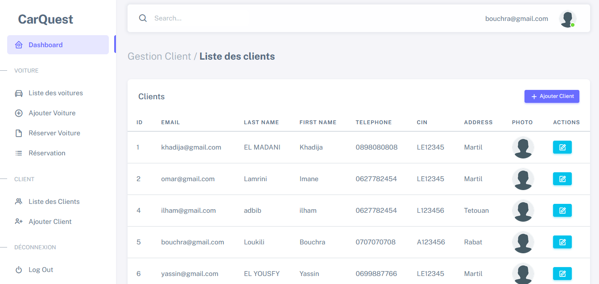

# CarQuest

CarQuest is a web application that enables managers to manage customers, cars and customer's rent car reservations, and the admin to manage managers of the application, based on a fluid CRUD architecture (Create, Read, Update and Delete).

## Group members:

CarQuest is from the most successful academic projects that is made collaboratively by:

- ADBIB Ilham
- EL MADANI Khadija
- LAMRINI Imane

## Used technologies:

This web application is made using the following technologies:

- **Flask** (as a framework of the Python backend technology for the management of the server side)
- **Bootstrap** (the styling framework frequently used for managing the style of the application)
- **MongoDB** (for non relational database management)

## Main Functionalities:

### Admin Space:

- Login to CarQuest.
- Access to the dashboard.
- Check main statistics: Number of: Customers, Cars, Managers and reservations.
- Check the list of all managers (id, full name and email).
- Add, edit and delete a manager.

### Manager Space:

- Login to CarQuest.
- Access to the dashboard.
- Check main statistics: Number of: Customers, Cars, total reservations (in progress, accepted, refused).
- Check the list of all cars (id, image, status, fuel, km, color, brand, model and rent price per day), customers (email, full name, phone number, CIN, address and photo), and reservations (id, start and end date, client and car name and status).
- Add, edit and delete car or client.
- Add reservation of car to a specified customer.
- Accept or refuse a reservation (if accepted, the manager can download an invoice containing all details of the reservation of a car for a specified customer).

## Screens of the app:

- Login:

 

### Admin Space:

- Dashboard Admin:

 

- List of managers:

 

- Add a manager:

 

### Manager Space:

- Dashboard Manager:

 

- List of cars:

 

- Add car:

 

- Edit car details:

 

- List of reservations:

 

- Add reservation:

 

- List of clients:

 

- Add client:

 

## Contributions:

Contributions are welcome. For any modification, you can submit, at first, an issue to commit for a better improvment of the experience of CarQuest.
